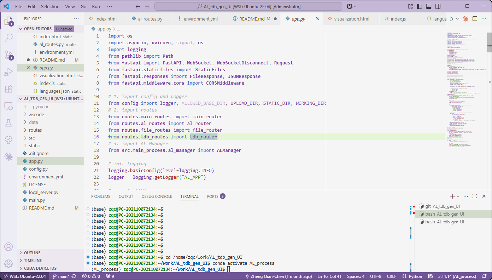

# AL_tdb_gen_workflow

A high-performance, multi-task Active Learning (AL) system designed for the automated generation of Thermodynamic Databases (TDB). This system integrates a FastAPI backend with an asynchronous task manager to bridge the gap between First-principles calculations and CALPHAD modeling.

## 🚀 Key Features

---

## 🛠️ Installation & Setup

### 1. Prerequisites
* **Windows Subsystem for Linux (WSL2)**: Ubuntu 22.04 LTS recommended.
* **Conda**: For environment and dependency management.
You can also utilize it in any device, as long it can install conda and python.

### 2. Environment Configuration

Clone the repository and create the environment using the provided specification file:

```bash
git clone https://github.com/Zheng-QianChen/AL_tdb_gen_workflow.git
cd AL_tdb_gen_workflow

# Create the Conda environment
conda env create -f environment.yml
conda activate AL_process

```

---

## 💻 Usage Manual

### 1. Starting the Server

Launch the FastAPI backend using the following command:

```bash
python main.py

```

* **Main Dashboard**: [http://localhost:8003](https://www.google.com/search?q=http://localhost:8003)
* **Interactive API Docs**: [http://localhost:8003/docs](https://www.google.com/search?q=http://localhost:8003/docs) (Swagger UI)

### 2. Workflow Orchestration

The system operates on a dual-channel communication model:

#### A. Task Initiation (HTTP)

Send a POST request to `/api/start_task` to initialize an AL process.
Example Payload:

```json
{
  "phase_name": "CU4TI",
  "record_path": "Phase_data/CU4TI/stack_result",
  "structure_file": "uploads/Cu4Ti_Cu4Ti_sd_0457419.cif",
  "structure_out_file": "Phase_data/CU4TI/struct/POSCAR.poscar",
  "structure_convert_to_primitive": "yes",
  "cif_sublatt": "",
  "init_random_n": 30,
  "tdb_model": {
    "site_holder": [
      "A",
      "B",
      "C",
      "D",
      "E"
    ],
    "site2sub": [
      [
        0
      ],
      [
        1
      ],
      [
        2
      ],
      [
        3
      ],
      [
        4
      ]
    ],
    "sublattice_number": 5,
    "occup_atoms_in_tdb": [
      1,
      1,
      1,
      1,
      1
    ],
    "comp": [
      [
        "CO",
        "CU",
        "FE",
        "NI",
        "TA",
        "TI",
        "W"
      ],
      [
        "CO",
        "CU",
        "FE",
        "NI",
        "TA",
        "TI",
        "W"
      ],
      [
        "CO",
        "CU",
        "FE",
        "NI",
        "TA",
        "TI",
        "W"
      ],
      [
        "CO",
        "CU",
        "FE",
        "NI",
        "TA",
        "TI",
        "W"
      ],
      [
        "CO",
        "CU",
        "FE",
        "NI",
        "TA",
        "TI",
        "W"
      ]
    ],
    "Atom_ref": {
      "file": "data/uploads/base_energy.csv",
      "index_name": "symbol",
      "col_name": "E_atom_eV_2"
    }
  },
  "AL_set": {
    "ML_model": "gbr",
    "ML_style": "stack",
    "descriptor": {
      "data/uploads/periodic_table.csv": {
        "index_name": "symbol",
        "col_name": [
          "atomic_number",
          "atomic_weight",
          "periodic",
          "family",
          "Calculated_radius_pm",
          "Electronegativity_Allen"
        ]
      },
      "data/uploads/base_energy.csv": {
        "index_name": "symbol",
        "col_name": [
          "E_atom_eV_2"
        ]
      }
    },
    "ML_hyper_parameters": "",
    "normalizer": "Zscore",
    "_c": "normalizer has two ways to choose: Zscore or mmscale",
    "eigen_weight": [
      1,
      1,
      1,
      1,
      1
    ],
    "iter_path": [],
    "quest": {
      "near_hall": 50,
      "random": 30,
      "unstable": 20
    },
    "generate_DFT_path": "Phase_data/CU4TI/stack_result/upload",
    "calced_DFT_path": "Phase_data/CU4TI/stack_result/calced",
    "pkl_phase_path": "Phase_data/CU4TI/stack_result/pkls",
    "pkl_show_control": "high"
  }
}

```

#### B. Real-time Feedback (WebSocket)

Connect to the WebSocket endpoint to receive live updates:
`ws://localhost:8003/ws?task=zqc_AlLi_Theta`

* **Snapshot**: Receive the current state of the iteration upon connection.
* **Updates**: Live data packets containing RMSE, iteration count, and running status.

### 3. Lifecycle Control

Tasks are managed by the `ALManager`. You can send control signals (`pause`, `stop`) via the WebSocket channel or the REST API. The system ensures a **Graceful Shutdown**, releasing all thread pool resources and saving progress before exiting.

---

## 📁 Project Structure

```text
AL_tdb_gen_workflow/
├── main.py              # Application entry point & FastAPI setup
├── src/
│   └── main_process/    # Core ALManager and Task Runner logic
├── routes/              # Modular API endpoints (AL, TDB, File, etc.)
├── config/              # Global settings and Logger configuration
├── static/              # Frontend assets (HTML, JS, CSS)
├── working/             # Active computation directory
└── environment.yml      # Conda environment specification
```

---

## HOW TO RUN

### 1. Using vscode or other terminal, open working file


### 2. Run
```bash
python app.py
```


open local website as feedback:
```text
 --- AL system is running ---
Main interface URL: http://localhost:8003
API documentation URL: http://localhost:8003/docs
```

### 3. using html


---
# Any questions:
e-mail: gz1999zqc@163.com